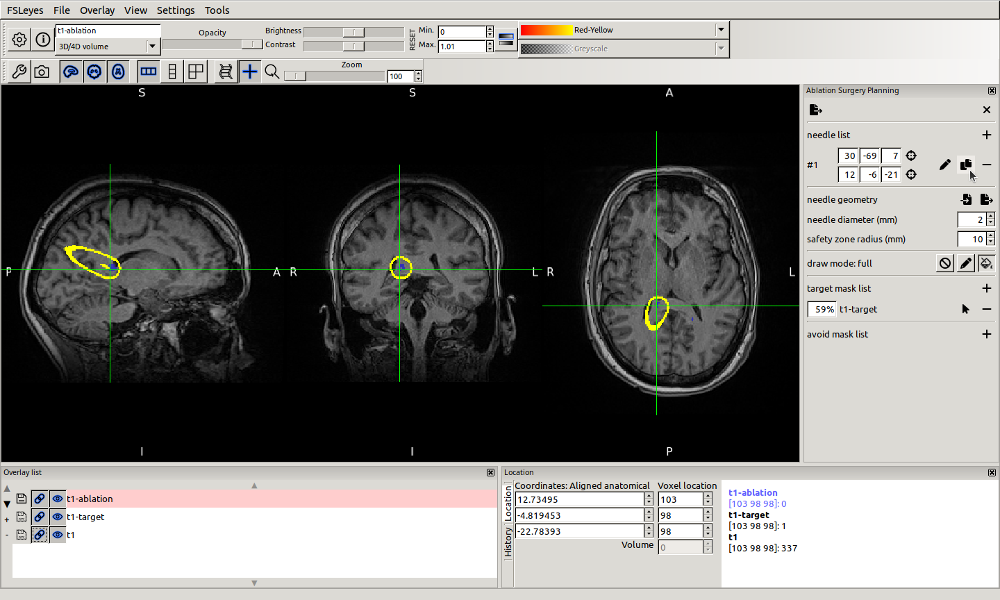

# Ablation Surgery Planning in FSLeyes

Laser interstitial Thermal Therapy is summarized in [LiTT.md](LiTT.md). Regarding the planning of the whole process, whose success depends on the accurate labeling of the lesions, a plugin for FSLeyes would be helpful. Given the areas to remove and the regions to avoid, entry and target points of a fiber set should be defined. All fibers (aka needles) follow the same specifications. An illustrative demonstration and detailed documentation of the software supporting these features are presented in the following sections.

_Konstantinos Raktivan, September 2022_

## Demonstration

To begin with, load the plugin into FSLeyes. Select the python script.


From the settings menu, open the plugin panel.


The plugin’s graphical interface is accessible through the panel on the right side.


Click on the button at the top left corner of the panel to create an empty needle list. New controls appear on the panel, while a blank in-memory overlay is prepended to the overlay list.


Click on the plus button to add a needle.


Move the location cursor to the target point and click on the second check button to mark the target point. The selected location’s global coordinates are displayed on the left as integers.


Now, focus on the entry point and click on the first check button to mark the entry point. A thin line connecting both points might be visible. This line is drawn on the new overlay.


To add the new needle to the needle list, click on the save button. It is recommended that another colormap is applied to the ablation overlay.


So far, needles are displayed as thin single line segments. Switch to full draw mode by clicking on the bucket button.


Rendering might need relatively more time. However, needles become more easily observable, as they are represented by thicker lines, according to the diameter value in the needle geometry section. Furthermore, a safety zone radius is provided to control a surrounding surface that indicates which regions will not be affected.


Both geometry parameters (needle diameter and safety zone radius) are given in millimeters and can be altered through the corresponding input fields.



To duplicate the registered needle, click on the clone button. This is a shortcut to creating a new needle and copying the coordinates of the previous one.


To mark some regions as a target to the process, select a suitable overlay and click on the appropriate plus button. The mask’s coverage percentage is noted on the left.


Locate and mark the second needle’s entry point, so that 100% of the target mask is covered. Reset the display range parameters (brightness and contrast) of the ablation overlay. Existing and temporary needles become distinct by their color.


Similarly, set a reasonable target point. The two needles do not touch each other.


Click on the save button to append the temporary second needle to the list.


Again, in order to mark the regions that should be avoided, select a suitable overlay and click on the appropriate plus button. An exclamation mark might appear on the right, which means that at least one needle’s safety zone intersects the mask.


Place the pointer over the exclamation symbol. A tooltip pops up with the serial number of the last needle entering the mask.


Click on the pencil button to edit the guilty needle.


Fix the entry point and reset the ablation overlay’s display range. If the resulting temporary needle avoids the mask, the exclamation mark will have been replaced by a check symbol.


Use the slider control to track the edited needle’s trajectory.


Click on the save button to submit the modified entry point coordinates.


Finally, to save the whole needle list, click on the export button at the top left corner of the panel. Select a desired directory and name for the json file.

## Documentation

### Overlay

Once a needle list is created, an in-memory overlay will be prepended to the overlay list. According to the selected draw mode, every needle will be drawn on this overlay with a value range depending on the needle’s serial number. If the ablation overlay is removed from the list, the needle list is immediately closed. Conversely, if the needle list is closed through the times button, the overlay will not be automatically removed.

### Needle

A needle is an oriented line segment in 3D space, defined by an entry and a target point. Coordinates of both points refer to the global coordinate system and are stored internally as triplets of float numbers.

Needles are built through a special form of the plugin panel. A check button that marks the cursor location is provided for each endpoint. The marked coordinates are displayed as an integer triplet and can be accessed through a focus button.

As long as both points have a value, the needle trajectory can be tracked by moving a slider control. Furthermore, any changes are depicted on the ablation overlay with a temporary instance of the needle and will be submitted to the needle list through the save button. On the contrary, the cancel button destroys the temporary instance and hides the needle form.

### Needle List

Ablation surgery may require multiple needles penetrating the brain simultaneously. All built needles constitute a numbered list and follow the same geometric specifications.

A needle list can be created from scratch through the new file button or by loading a suitable json file through the import file button. Each needle has a serial number and is listed as a pair of integer triplets with their focus buttons that move the location cursor to the specific point. At any time the export button saves the needle list along with the registered geometry into a json file. A click on the times button closes the needle list and initializes the plugin panel.

Needles can be added to the end of the list through the plus button or edited through the pencil button. In both cases, the needle form is shown and must be submitted for the changes to take place. A copy button is a shortcut to adding a new needle and prefilling the coordinates. Additionally, a needle can be removed from the list through the minus button.

### Geometry

The thickness of all needles is configured through the diameter control. Moreover, the region that will be affected is set through the safety zone radius control. Both geometric values are given in millimeters and their effect becomes visible once full draw mode is selected. It is obvious that the safety zone radius can not be less than half the needle diameter.

Geometry characteristics are imported and exported along with the needle list. However, they can be separately loaded from and saved to a json file through the corresponding local buttons.

### Draw Modes

Needles are drawn on the ablation overlay according to the selected draw mode. There are three draw modes available, none, line and full, applied using the empty, pencil and bucket toggle buttons respectively. None disables drawing, which means that the overlay will be an empty image. Actions of editing the needle list are instantaneous at the cost of no visual feedback. Line is the default mode and results in assigning the value of the serial number to the overlay voxels that connect the entry and target points, for each needle. Lastly, when full mode is selected and according to the provided values for the geometry parameters, a fiber of appropriate diameter connecting the two endpoints is drawn, while a thin dividing surface on the limits of the safety zone is colored with a slightly different value. Compared to the default option, full draw mode is computationally more expensive and might delay the rendering of the needles after any action, but the user is compensated with a detailed visual feedback and precise metrics of surgery planning suitability.

### Target Mask List

Areas that must be removed can be declared through an arbitrary number of masks. These masks should be compatible with the ablation overlay, which means they should have identical shapes, affine transformations and spatial units. The selected overlay is added as a target mask through the plus button, while an added mask can be removed through the minus button and can be selected in the overlay list through the pointer button. The purpose of this section is the indication of each mask’s coverage degree by the current planning and it is calculated correctly as an integer percentage when full draw mode is selected.

### Avoid Mask List

Regions that should be avoided can also be declared through a similar interface as with the target mask list. The difference is that instead of the coverage degree, for each mask an exclamation mark implies that at least one needle’s safety zone intersects the mask, in which case the last needle in question is noted through a tooltip, while a check symbol suggests that the mask is completely avoided.

### JSON File Syntax

Before providing the structure of an importable json file, two data types should be considered: the `point`, a triplet of numbers (list of three numbers); and the `needle`, an object with keys `entry` and `target` and corresponding values of type `point`.

A json file that can be imported as a needle list should represent an object with three properties: the actual list named `needles` with a list of `needle` objects as a value; and the `diameter` and `safezone` properties with integer values.

```json
{
    "needles": [
        {
            "entry": [
                30.273439999999994,
                -68.99540710449219,
                6.96063232421875
            ],
            "target": [
                11.71875,
                -5.5188446044921875,
                -21.03936767578125
            ]
        },
        {
            "entry": [
                -21.484375,
                -69.97196960449219,
                15.96063232421875
            ],
            "target": [
                -18.554689999999994,
                -14.307907104492188,
                -26.03936767578125
            ]
        }
    ],
    "diameter": 2,
    "safezone": 10
}
```

On the other hand, a json file having the same structure but without the `needles` property can be imported from the needle geometry section of the plugin panel to override only the geometry characteristics.

```json
{
    "diameter": 3,
    "safezone": 15
}
```
